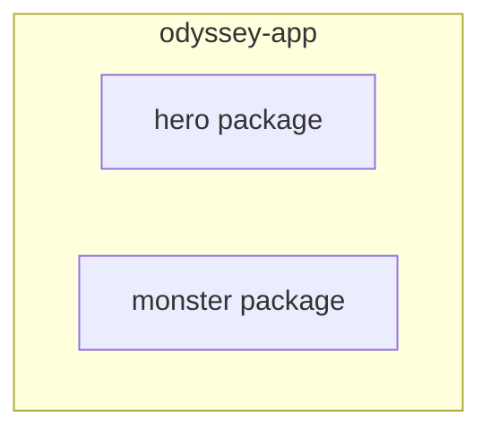

# <StageIcon name="column" :size="40" /> Ithaca

<WaveDivider />

Single-module build — home base, where every project starts

One module, **`odyssey-app`**, holds both of our domain entities:

- **Hero** — `id`, `name`, `epithet`, `strength`
- **Monster** — `id`, `name`, `domain`, `danger`

One build, one deployable.

<!--
Every odyssey begins at home. Our journey starts with odyssey-app — one Gradle module,
one Spring Boot application, housing both of our domain entities side by side.

A single build.gradle.kts wires up Spring Boot, Kotlin, R2DBC, and Flyway for the whole app.
No modules to split, no boundaries to cross — just one build, one deployable, one place to look.
-->

---
transition: slide-up
---

## Schematic View

---
transition: slide-down
---

## Code Demo

<!--
TODO: content
-->

---
transition: slide-down
---

## Pros & Cons

  

    <h3 style="color: var(--odyssey-gold)">Pros</h3>
    <ul>
      <li>Zero setup — one <code>build.gradle.kts</code>, one command to build and run</li>
      <li>Single dependency graph, trivial to reason about</li>
      <li>No build-logic duplication, because there's only one build</li>
    </ul>
  

  

    <h3 style="color: var(--odyssey-wine)">Cons</h3>
    <ul>
      <li>Heroes and Monsters can't deploy independently</li>
      <li>A change to either domain forces rebuilding and redeploying both</li>
      <li>Team ownership boundaries blur inside one module</li>
    </ul>
  

---
transition: slide-left
---

## Conclusion

One module, one build — but Heroes and Monsters need to ship on separate schedules.

<!--
The simplest way to start a journey: one module, one build, nothing to configure.
But Heroes and Monsters have outgrown the same ship — they need to ship on separate
schedules, and a single module can't give them that. Time to set sail.
-->
