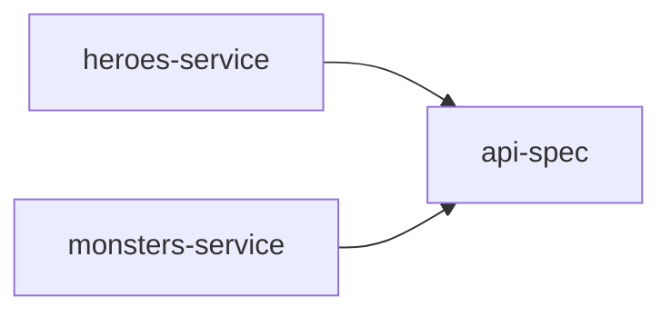

# <StageIcon name="ship" :size="40" /> Setting Sail

<WaveDivider />

Multi-module build — a fleet of modules, one voyage

Hero and Monster set sail as their own services, sharing one `api-spec`.

<!--
Ithaca's single module splits into three: heroes-service and monsters-service become
independent Spring Boot deployables, each able to ship on its own schedule. A third module,
api-spec, holds the OpenAPI contract both services depend on — the shared code that lets
them talk to each other for the /encounters endpoint.

The catch: each module now hand-rolls its own Spring Boot, Kotlin, and OpenAPI-codegen
build setup. That duplication is this stage's problem to notice.
-->

---
transition: slide-up
---

## Schematic View

---
transition: slide-down
---

## Code Demo

<!--
TODO: content
-->

---
transition: slide-down
---

## Pros & Cons

  

    <h3 style="color: var(--odyssey-gold)">Pros</h3>
    <ul>
      <li><code>heroes-service</code> and <code>monsters-service</code> deploy independently</li>
      <li>Clear module boundaries mirror service boundaries</li>
      <li><code>api-spec</code> gives each service a single shared contract</li>
    </ul>
  

  

    <h3 style="color: var(--odyssey-wine)">Cons</h3>
    <ul>
      <li>Spring Boot, Kotlin, and OpenAPI-codegen setup copy-pasted across 3 modules</li>
      <li>Version bumps must be repeated in every module's <code>build.gradle.kts</code></li>
      <li>No shared place to fix a build mistake — it must be fixed three times</li>
    </ul>
  

---
transition: slide-left
---

## Conclusion

Independent deployability, at the cost of the same build setup — copy-pasted three times over.

<!--
Splitting into services won us independent deployability, but it cost us — the same
Spring Boot, Kotlin, and OpenAPI-codegen setup is now hand-rolled three times over,
once per module. Time to stop copy-pasting build logic.
-->
