# <StageIcon name="eye" :size="40" /> The Cyclops's Cave

<WaveDivider />

`buildSrc` — powerful, but trapped on one island

 

One `buildSrc` convention plugin replaces three copies of build boilerplate.

<!--
The three modules from Setting Sail each hand-rolled their own Spring Boot, Kotlin, and
OpenAPI-codegen setup. buildSrc lets us pull that duplicated logic into one convention
plugin, applied by heroes-service, monsters-service, and api-spec alike — a single source
of truth for this repo's build logic.

The catch: buildSrc only exists inside this repo. Like the Cyclops's cave, it's powerful
but sealed off — nothing inside it can be reused by any other project without copying the
whole thing over again.
-->

---
transition: slide-up
---

<StageFooter icon="eye" name="The Cyclops's Cave" />

## Schematic View

```mermaid {scale: 0.85}
%%{init: {'theme': 'base', 'themeVariables': {
  'primaryColor': '#3d2f14',
  'primaryTextColor': '#e8dcc4',
  'primaryBorderColor': '#d4af37',
  'lineColor': '#d4af37',
  'edgeLabelBackground': '#0d1b2a',
  'fontFamily': 'Georgia, serif'
}}}%%
flowchart LR
    subgraph repo["one repo"]
        direction LR
        subgraph h["heroes-service"]
            hb["build.gradle.kts<br/>applies plugin"]:::config
        end
        subgraph m["monsters-service"]
            mb["build.gradle.kts<br/>applies plugin"]:::config
        end
        subgraph a["api-spec"]
            ab["build.gradle.kts<br/>applies plugin"]:::config
        end
        plugin["buildSrc<br/>convention plugin"]:::plugin
        plugin -.-> hb
        plugin -.-> mb
        plugin -.-> ab
        h --> a
        m --> a
    end
    style repo fill:#0d1b2a,stroke:#d4af37,stroke-width:2px,stroke-dasharray:4 4
    style h fill:#3d2f14,stroke:#d4af37,stroke-width:1px
    style m fill:#3d2f14,stroke:#d4af37,stroke-width:1px
    style a fill:#3d2f14,stroke:#d4af37,stroke-width:1px
    classDef config fill:#7a1f2b,stroke:#d4af37,stroke-width:2px,color:#e8dcc4
    classDef plugin fill:#1b3a4b,stroke:#d4af37,stroke-width:2px,color:#e8dcc4
```

---
transition: slide-down
---

<StageFooter icon="eye" name="The Cyclops's Cave" />

## Code Demo

<!--
TODO: content
-->

---
transition: slide-down
---

<StageFooter icon="eye" name="The Cyclops's Cave" />

## Pros & Cons

 

  

    <h3 style="color: var(--odyssey-gold)">Pros</h3>
    <ul>
      <li>Build logic deduplicated into <code>buildSrc</code> convention plugins</li>
      <li>One place to fix or evolve the Spring Boot/Kotlin conventions</li>
      <li>Modules apply a single plugin id instead of hand-rolled blocks</li>
    </ul>
  

  

    <h3 style="color: var(--odyssey-wine)">Cons</h3>
    <ul>
      <li><code>buildSrc</code> is trapped inside this repo — no other project can reuse it</li>
      <li>Reusing it elsewhere means copy-pasting <code>buildSrc</code> itself</li>
      <li>Any change inside <code>buildSrc</code> invalidates the whole build's configuration cache</li>
    </ul>
  

---
transition: slide-left
---

<StageFooter icon="eye" name="The Cyclops's Cave" />

## Conclusion

<code>buildSrc</code> is a cave, not a harbor — nothing inside it can leave this repo.

<!--
buildSrc deduplicated the build logic beautifully — one source of truth, for this repo.
But that's exactly its limit: buildSrc is a cave, not a harbor. Nothing inside it can leave,
so any other project wanting this build logic has to copy the whole cave.
-->
