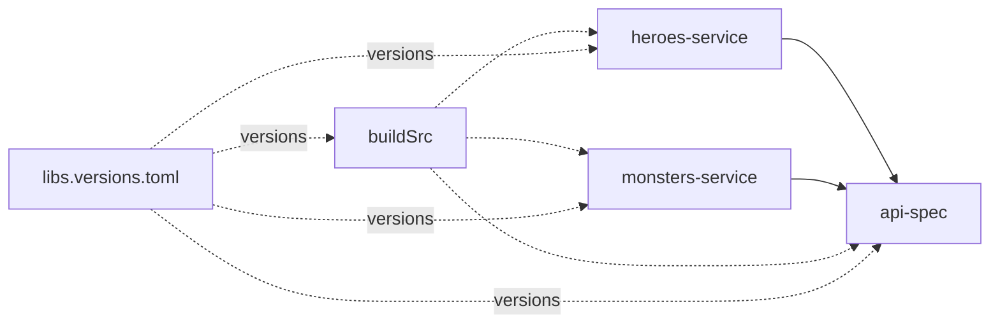

# <StageIcon name="waves" :size="40" /> The Sirens

<WaveDivider />

Version catalogs & BOMs — the tempting shortcut of centralizing versions

<!--
TODO: content
-->

---
transition: slide-up
---

## Schematic View

---
transition: slide-down
---

## Code Demo

<!--
TODO: content
-->

---
transition: slide-down
---

## Pros & Cons

  

    <h3 style="color: var(--odyssey-gold)">Pros</h3>
    <ul>
      <li>One file (<code>libs.versions.toml</code>) aligns every dependency version</li>
      <li>No more version drift between modules and <code>buildSrc</code></li>
      <li>Upgrading a library is a one-line change</li>
    </ul>
  

  

    <h3 style="color: var(--odyssey-wine)">Cons</h3>
    <ul>
      <li>Doesn't solve cross-repo reuse — only versions are centralized, not build logic</li>
      <li>The catalog file itself must still be copy-pasted into any other repo</li>
      <li>Catalog syntax adds a small learning curve versus plain version strings</li>
    </ul>
  

---
transition: slide-left
---

## Conclusion

Version catalogs centralize what <code>buildSrc</code> alone couldn't: consistent versions across every module, with no drift. But the build logic itself is still landlocked in this one repo — the real prize is still ahead.
