# <StageIcon name="waves" :size="40" /> The Sirens

<WaveDivider />

Version catalogs & BOMs — the tempting shortcut of centralizing versions

 

One `libs.versions.toml` aligns every dependency version, everywhere.

<!--
buildSrc deduplicated our build logic, but dependency versions are still hardcoded and
drifting across the three modules and buildSrc itself. A version catalog — gradle/libs.versions.toml —
becomes the single source of truth for every version, referenced from every module and buildSrc.

Tempting as it sounds, this only solves version drift. It doesn't solve the real limitation
from the last stage: the build logic itself is still landlocked in this one repo.
-->

---
transition: slide-up
---

<StageFooter icon="waves" name="The Sirens" />

## Schematic View

```mermaid {scale: 0.75}
%%{init: {'theme': 'base', 'themeVariables': {
  'primaryColor': '#3d2f14',
  'primaryTextColor': '#e8dcc4',
  'primaryBorderColor': '#d4af37',
  'lineColor': '#d4af37',
  'edgeLabelBackground': '#0d1b2a',
  'fontFamily': 'Georgia, serif'
}}}%%
flowchart LR
    subgraph repo["one repo"]
        direction LR
        catalog["libs.versions.toml"]:::catalog
        subgraph h["heroes-service"]
            hb["build.gradle.kts<br/>applies plugin"]:::config
        end
        subgraph m["monsters-service"]
            mb["build.gradle.kts<br/>applies plugin"]:::config
        end
        subgraph a["api-spec"]
            ab["build.gradle.kts<br/>applies plugin"]:::config
        end
        plugin["buildSrc<br/>convention plugin"]:::plugin
        plugin -.-> hb
        plugin -.-> mb
        plugin -.-> ab
        h --> a
        m --> a
    end
    catalog -.->|versions| plugin
    catalog -.->|versions| hb
    catalog -.->|versions| mb
    catalog -.->|versions| ab
    style repo fill:#0d1b2a,stroke:#d4af37,stroke-width:2px,stroke-dasharray:4 4
    style h fill:#3d2f14,stroke:#d4af37,stroke-width:1px
    style m fill:#3d2f14,stroke:#d4af37,stroke-width:1px
    style a fill:#3d2f14,stroke:#d4af37,stroke-width:1px
    classDef config fill:#7a1f2b,stroke:#d4af37,stroke-width:2px,color:#e8dcc4
    classDef plugin fill:#1b3a4b,stroke:#d4af37,stroke-width:2px,color:#e8dcc4
    classDef catalog fill:#1b3a4b,stroke:#a8c5d4,stroke-width:2px,color:#e8dcc4
```

---
transition: slide-down
---

<StageFooter icon="waves" name="The Sirens" />

## Code Demo

<!--
TODO: content
-->

---
transition: slide-down
---

<StageFooter icon="waves" name="The Sirens" />

## Pros & Cons

 

  

    <h3 style="color: var(--odyssey-gold)">Pros</h3>
    <ul>
      <li>One file (<code>libs.versions.toml</code>) aligns every dependency version</li>
      <li>No more version drift between modules and <code>buildSrc</code></li>
      <li>Upgrading a library is a one-line change</li>
    </ul>
  

  

    <h3 style="color: var(--odyssey-wine)">Cons</h3>
    <ul>
      <li>Doesn't solve cross-repo reuse — only versions are centralized, not build logic</li>
      <li>The catalog file itself must still be copy-pasted into any other repo</li>
      <li>Catalog syntax adds a small learning curve versus plain version strings</li>
    </ul>
  

---
transition: slide-left
---

<StageFooter icon="waves" name="The Sirens" />

## Conclusion

Versions are aligned everywhere — but the build logic is still steering straight for the cliffs.

<!--
Version catalogs centralize what buildSrc alone couldn't: consistent versions across
every module, with no drift. But the build logic itself is still steering straight for
the cliffs — trapped in this one repo, with no way to reuse it elsewhere. The real prize,
true cross-repo reuse, is still ahead.
-->
