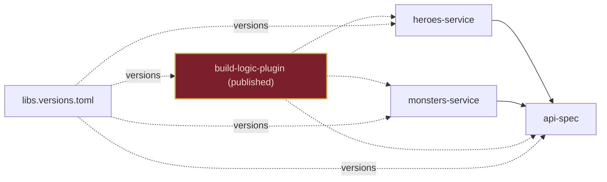

# <StageIcon name="laurel" :size="40" /> Ithaca, Regained

<WaveDivider />

Published, shared plugin — home again, transformed

`buildSrc` becomes a published plugin — reusable far beyond this repo.

<!--
The final transformation: buildSrc's convention plugins are extracted into their own
standalone Gradle plugin project, build-logic-plugin, published to mavenLocal(). Instead of
copying build logic into every new repo, heroes-service and monsters-service simply apply
it via plugins { id(...) } — versioned through the same libs.versions.toml catalog.

This is the payoff for the whole journey: what started as a single module's build.gradle.kts
is now build logic any project can adopt, with no copying and no drift.
-->

---
transition: slide-up
---

## Schematic View

---
transition: slide-down
---

## Code Demo

<!--
TODO: content
-->

---
transition: slide-down
---

## Pros & Cons

  

    <h3 style="color: var(--odyssey-gold)">Pros</h3>
    <ul>
      <li>Build logic published once, consumed by any project via <code>plugins { id(...) }</code></li>
      <li>True reuse — no copy-pasting <code>buildSrc</code> or the catalog into new repos</li>
      <li>Central place to version and release build-logic changes</li>
    </ul>
  

  

    <h3 style="color: var(--odyssey-wine)">Cons</h3>
    <ul>
      <li>Adds publishing and versioning ceremony for the plugin itself</li>
      <li>Requires a real (or local) plugin repository and release discipline</li>
      <li>Shared build-logic changes now need their own release before consumers pick them up</li>
    </ul>
  

---
transition: slide-left
---

## Conclusion

Home again, transformed — build logic any project can adopt, with no copying, no drift.

<!--
Home again, transformed: what started as a single module is now build logic any project
can adopt, published and versioned like any other dependency — no copying, no drift, no cave.
The voyage that began with one simple build ends with one that scales to as many as you need.
-->
